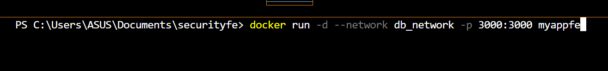
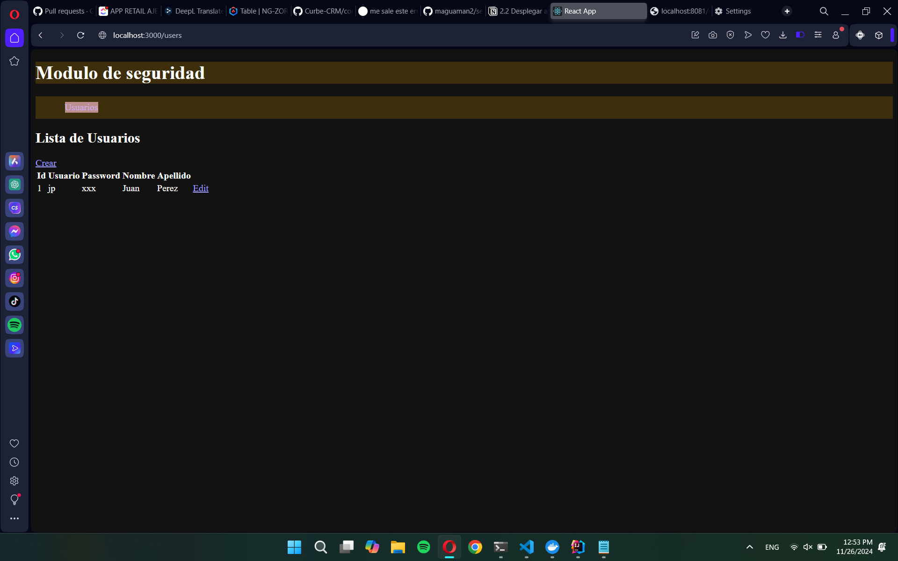

# Implementación de una Aplicación React en Docker

## Tiempo de duración
20 minutos

## Fundamentos
Docker es una plataforma que permite desarrollar, enviar y ejecutar aplicaciones en contenedores. Un contenedor es una unidad estándar de software que empaqueta el código y todas sus dependencias para que la aplicación se ejecute rápidamente y de manera confiable en diferentes entornos de computación.

El uso de contenedores ofrece varias ventajas, como la portabilidad, la escalabilidad y la eficiencia en el uso de recursos. Docker utiliza imágenes, que son plantillas de solo lectura, para crear contenedores. Estas imágenes pueden ser compartidas y versionadas, lo que facilita la colaboración entre desarrolladores.

Para crear una imagen de Docker para una aplicación React, se necesita un archivo llamado Dockerfile. Este archivo contiene una serie de instrucciones que Docker utiliza para construir la imagen. En nuestro caso, el Dockerfile especifica que se utilizará una imagen base de Node.js, se configurará un directorio de trabajo, se instalarán las dependencias de la aplicación y se iniciará la misma.

## Conocimientos previos
Para realizar esta práctica, el estudiante necesita tener claro los siguientes temas:
- Comandos de Docker.
- Manejo de la terminal o línea de comandos.
- Conceptos básicos de redes.
- Fundamentos de React.

## Objetivos a alcanzar
- Implementar una aplicación React en un contenedor Docker.
- Manipular archivos de configuración de Docker para personalizar la aplicación.
- Entender el flujo de trabajo de creación y ejecución de contenedores.

## Equipo necesario
- Computador con sistema operativo Windows/Linux/Mac.
- Cuenta en Docker Hub.
- Docker versión 20.10 o superior instalada en el sistema.

## Material de apoyo
- Guía de asignatura proporcionada por el instructor.
- Cheat sheet de comandos de Linux.

## Procedimiento
### Paso 1: Crear el archivo Dockerfile
Crea un archivo llamado `Dockerfile` en la carpeta raíz de tu proyecto React. El contenido del archivo debe ser el siguiente:

### Paso 2: Crear la imagen
Ejecuta el siguiente comando en la terminal para construir la imagen de Docker.

### Paso 3: Ejecutar el contenedor
Crea y ejecuta un contenedor a partir de la imagen que acabas de crear, utilizando el puerto 3000.

### Paso 4: Probar la aplicación
Abre tu navegador y navega a [http://localhost:3000](http://localhost:3000). Deberías ver la lista de usuarios de la base de datos, lo que indica que la aplicación está funcionando correctamente. Esto es equivalente a acceder a [http://localhost:8081/users](http://localhost:8081/users).

## Resultados esperados
Al finalizar la práctica, deberías poder acceder a la aplicación React en tu navegador y visualizar la lista de usuarios de la base de datos. A continuación, se muestra una captura de pantalla del resultado final:

*Resultado de la aplicación en el navegador.*

## Bibliografía
Criollo, K. (2024). 
